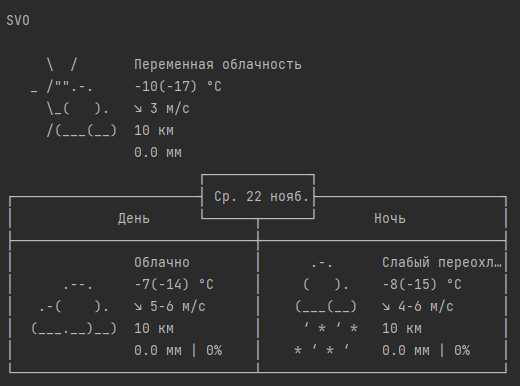

# Описание работы программы weatherapp.py

## Общее описание програмы
Программа в терминале отображает погоду на три для в выбранных локациях.

При необходимости можно менять локацию (переменная places) и настройки отображения (переменная settings).
Расшифровка ключей находиться по адресу https://wttr.in/:help

Запускается через терминал, переходим в каталог, в котором расположен скрипт и выполняем следующие команды.

    python -m pip install -r requirements.txt
    python weatherapp.py

Пример корректного вывода программы для аэропорта Шереметьево:

